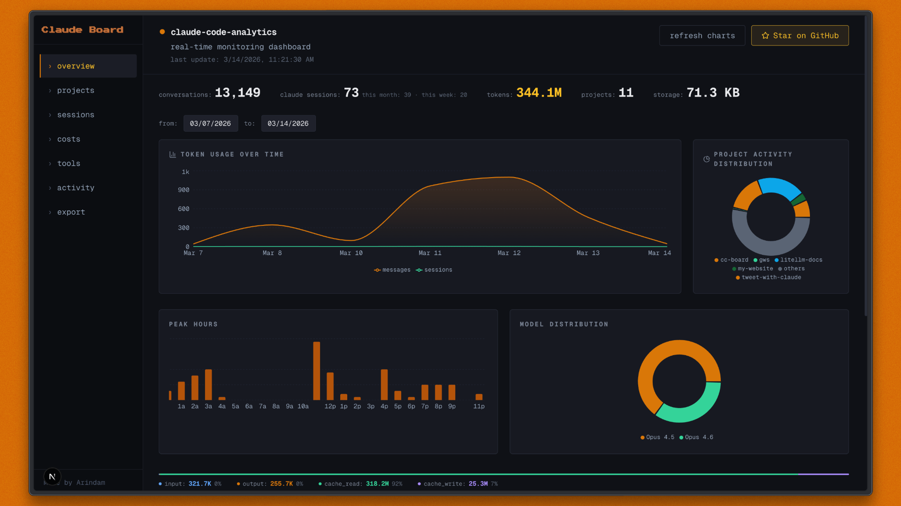

# Claude Code Dashboard (CC-board)

A real-time monitoring dashboard for **Claude Code** analytics. Reads directly from `~/.claude/` — no cloud, no telemetry, just your local data.

## Features

- **Overview** — Token usage over time, project activity distribution, peak hours, model breakdown, recent conversations
- **Projects** — Card grid with sessions, cost per session, most-used tools, languages, git branches
- **Sessions** — Sortable table with search, filters (compacted, agent, MCP), and full session replay
- **Costs** — Model breakdown, cost by project, cache efficiency
- **Tools** — Tool ranking by category, MCP server usage, feature adoption
- **Activity** — Streaks, day-of-week patterns, usage over time
- **Export** — Download `.ccboard.json` or import with additive merge preview

## Getting Started

### Prerequisites

- Node.js 18+
- Claude Code with local data in `~/.claude/`

### Run

```bash
npm install
npm run dev
```

Open [http://localhost:3000](http://localhost:3000) (or the port shown in the terminal).

### Build

```bash
npm run build
npm start
```

## Data Source

- `~/.claude/projects/<slug>/*.jsonl` — Session JSONL (primary)
- `~/.claude/stats-cache.json` — Aggregated stats
- `~/.claude/usage-data/session-meta/` — Session metadata (fallback)

Data refreshes every 5 seconds while the dashboard is open.

## Tech Stack

- Next.js 16 · React 19 · TypeScript
- Tailwind CSS · Recharts · SWR
